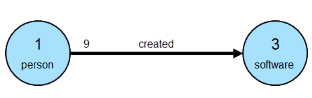

# gremlin-tutorial

## [Introduction to Gremlin](https://tinkerpop.apache.org/gremlin.html)

- Each Gremlin traversal is composed of (sequential, potentially nested) steps.
- A step can be a:
  - map
    - Transform objects in the stream
  - filter
    - Remove objects from the stream
  - sideEffect
    - Compute statistics about the stream
- Gremlin traversals can be OLTP or OLAP.
- Gremlin traversals can be imperative or declarative.

## [Getting Started](https://tinkerpop.apache.org/docs/current/tutorials/getting-started/)

### The First Five Minutes

```sh
# Download the Gremlin Console
curl -O https://mirror.olnevhost.net/pub/apache/tinkerpop/3.4.8/apache-tinkerpop-gremlin-console-3.4.8-bin.zip
# Unpackage
unzip apache-tinkerpop-gremlin-console-3.4.8-bin.zip
cd apache-tinkerpop-gremlin-console-3.4.8
# Start
bin/gremlin.sh
```

- A `TraversalSource` instance holds a reference to a `Graph` instance.
  - The `Graph` holds the graph's structure and data.
- TinkerPop is a graph abstraction layer that works on top of various graph databases and processors.
  - Suggested starting out Graph instance: [TinkerGraph](https://tinkerpop.apache.org/docs/3.4.8/reference/#tinkergraph-gremlin)
- The 'Modern' graph:
  - 
- Instantiate a Modern graph:

  - Create a `Graph` instance named `graph`.
    - This provides a reference to the data we want Gremlin to traverse.
  - Create a `TraversalSource`.
    - This provides additional information to Gremlin, such as the traversal strategies and the traversal engine to use.
    - Note that a `Traversal` is essentially an `Iterator`.
      - So `x = g.V()` doesn't assign the _results_ to `x`, but an _Iterator_.
        - To get results, we need to iterate through `x`.
        - When working in the console, the Iterator returns the result automatically. Outside the console, we need to 'iterate the traversal'.

  ```groovy
  graph = TinkerFactory.createModern()
  // ==>tinkergraph[vertices:6 edges:6]
  g = graph.traversal()
  // ==>graphtraversalsource[tinkergraph[vertices:6 edges:6], standard]

  // 1. Get all the vertices in the Graph.
  g.V();
  // ==>v[1]
  // ==>v[2]
  // ==>v[3]
  // ==>v[4]
  // ==>v[5]
  // ==>v[6]

  // 2. Get the vertex with the unique identifier `1`.
  g.V(1)
  // ==>v[1]

  // 3. Get the value of the `name` property on the vertex with the unique identifier `1`.
  g.V(1).values('name')
  // ==>marko

  // 4. Get the edges with the label `knows` for the vertex with the unique identifier `1`.
  g.V(1).outE('knows')
  // ==>e[7][1-knows->2]
  // ==>e[8][1-knows->4]

  // 5. Get the names of the people whom the vertex with the unique identifier of `1` `knows`.
  g.V(1).outE('knows').inV().values('name')
  // ==>vadas
  // ==>josh

  // 6. `out()`: Shorthand for `outE().inV()`.
  // 6b. `in()`: Shorthand for `inE().outV()`.
  g.V(1).out('knows').values('name')
  // ==>vadas
  // ==>josh

  // 7. Get the names of the people vertex `1` `knows` who are over age `30`.
  g.V(1).out('knows').has('age', gt(30)).values('name')
  // ==>josh
  ```

### The Next Fifteen Minutes

- A graph with 2 vertices:
  - 
    - `1`: Unique identifier for one vertex
    - `3`: Unique identifier for another vertex
    - `9`: Unique identifier for an edge connecting the two vertices.
      - Note that an edge has a direction. Here, _out_ `1` and _in_ `3`.
    - Note that most TinkerPop implementations don't allow for identifier assignment.
      - TinkerGraph _does_ allow identifier assignment, unlike most graph databases.
- A graph with labels:
  - 
- A property graph (with arbitrary properties in addition to the `label` and `id` reserved attributes):
  - 
- Create a graph and configure it as in the above models.

  ```groovy
  graph = TinkerGraph.open()
  g = graph.traversal()

  v1 = g.addV("person").property(id, 1).property("name", "marko").property("age", 29).next()
  v2 = g.addV("software").property(id, 3).property("name", "lop").property("lang", "java").next()
  g.addE("created").from(v1).to(v2).property(id, 9).property("weight", 0.4)
  ```

  - `id` belongs to enum `T`; without static importing, would use `t.id` instead.
    - JVM fully-qualified name for `T`: `org.apache.tinkerpop.gremlin.structure.T`.
  - Another common import: `org.apache.tinkerpop.gremlin.process.traversal.dsl.graph.__`.
    - Allows for creation of [anonymous traversals](https://tinkerpop.apache.org/docs/3.4.8/reference/#graph-traversal-steps).
  - The label for an `Edge` is required.
    - Thus, it's part of the method signature for `addEdge()`.
      - Is this the same as `addE()` above?

### Graph Traversal - Staying Simple

- Traversal: Executing some [process](https://tinkerpop.apache.org/docs/3.4.8/reference/#the-graph-process) over the structure of a graph.
- Example: "What software has Marko created"

  1. Find `marko`

     ```groovy
     g.V().has('name', 'marko')
     ```

     - Slight improvement: Include the vertex label as part of the filter to ensure the `name` property refers to a `person` vertex:

       ```groovy
       g.V().has('person', 'name', 'marko')
       ```

     - Note that this query iterates _all_ the vertices in the graph.
       - In larger graphs, use indices.
         - TinkerPop does not provide an abstraction for index management.
         - Indices are database-specific and will be used transparently at execution time; the syntax of the traversals will not change.

  2. Move to outgoing `created` edges from the `marko` vertex.

     ```groovy
     g.V().has('person', 'name', 'marko').outE('created')
     ```

  3. Move from the edge to the incoming vertex:

     ```groovy
     g.V().has('person', 'name', 'marko').outE('created').inV()
     ```

     - Since we aren't doing anything with the properties of the `created` edge, we can use shorthand:

       ```groovy
       g.V().has('person', 'name', 'marko').out('created')
       ```

  4. Extract the `name` property.

     ```groovy
     g.V().has('person', 'name', 'marko').out('created').values('name')
     ```

### Graph Traversal - Increasing Complexity

- Switch back to the 'Modern' graph:

  ```groovy
  graph = TinkerFactory.createModern()
  g = graph.traversal()
  ```

- Find the `age` values of both `vadas` and `marko`:

  ```groovy
  g.V().has('person', 'name', within('vadas', 'marko')).values('age')
  ```

  - `within()` is statically imported from `P` in the Gremlin console.
    - JVM: `org.apache.tinkerpop.gremlin.process.traversal.P`

- Get the average age of `vadas` and `marko`:

  ```groovy
  g.V().has('person', 'name', within('vadas', 'marko')).values('age').mean()
  ```

- Who are the people that `marko` develops software with?

  ```groovy
  g.V().has('person', 'name', 'marko').out('created').in('created').values('name')
  ```

  - Excluding `marko`:

  ```groovy
  g.V().has('person', 'name', 'marko').as('exclude').out('created').in('created').where(neq('exclude')).values('name')
  ```

  - Note that `as()` isn't really a step, but a 'step modulator', adding features to a step.

    - It labels the `has()` step with `exclude`.
    - Example of `as()` with `select()`:

      ```groovy
      g.V().as('a').out().as('b').out().as('c').select('a','b','c')
      // ==>[a:v[1],b:v[4],c:v[5]]
      // ==>[a:v[1],b:v[4],c:v[3]]
      ```

- Group all vertices by vertex label

  ```groovy
  g.V().group().by(label)
  // ==>[software:[v[3],v[5]],person:[v[1],v[2],v[4],v[6]]]
  ```

  - `label`: Static import from `T`.
  - Show name:

    ```groovy
    g.V().group().by(label).by('name')
    // ==>[software:[lop,ripple],person:[marko,vadas,josh,peter]]
    ```

### The Final Ten Minutes

- TinkerPop.3.x provides not only an abstraction over different graph databases, but also over different graph processors (e.g., Spark).
  - To utilize this, the Gremlin traversal code does not change; changes are isolated to the `TraversalSource` definition.
    - Another reason to execute graph operations through the `TraversalSource` instead of just the `Graph`.

### Additional Docs

- http://kelvinlawrence.net/book/Gremlin-Graph-Guide.html
